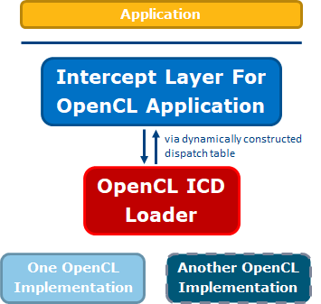

# Intercept Layer for OpenCLTM Applications
GitHub Actions: 

The Intercept Layer for OpenCL Applications is a tool that can intercept
and modify OpenCL calls for debugging and performance analysis.  Using the
Intercept Layer for OpenCL Applications requires no application or driver
modifications.

To operate, the Intercept Layer for OpenCL Applications masquerades as the
OpenCL ICD loader (usually) or as an OpenCL implementation (rarely) and is
loaded when the application intends to load the real OpenCL ICD loader.  As
part of the Intercept Layer for OpenCL Application's initialization, it loads
the real OpenCL ICD loader and gets function pointers to the real OpenCL
entry points.  Then, whenever the application makes an OpenCL call, the call
is intercepted and can be passed through to the real OpenCL with or without
changes.

This project adheres to the Intercept Layer for OpenCL Application's
[code of conduct](CODE_OF_CONDUCT.md).  By participating, you are expected to
uphold this code.

## Documentation

All controls are documented [here](docs/controls.md).

Instructions to build the Intercept Layer for OpenCL Applications can be found [here](docs/build.md).

Instructions to use the Intercept Layer for OpenCL Applications Loader (`cliloader`) can be found [here](docs/cliloader.md).

Instructions for the old loader (`cliprof`) can still be found [here](docs/cliprof.md).

Instructions to install the Intercept Layer for OpenCL Applications can be found [here](docs/install.md).

Troubleshooting steps and answers to frequently asked questions can be found [here](docs/FAQ.md).

Detailed instructions:
* [How to Inject Modified Programs](docs/injecting_programs.md)
* [How to Dump and Disassemble Kernel ISA](docs/kernel_isa.md)
* [How to Capture AUB Files](docs/aubcapture.md)
* [How to Collect MDAPI Performance Metrics](docs/mdapi.md)
* [How to Use the Intercept Layer for OpenCL Applications with VTune](docs/vtune_logging.md)
* [How to Use the Intercept Layer for OpenCL Applications with Chrome](docs/chrome_tracing.md)
* [How to Capture and Replay Single Kernels](docs/capture_single_kernels.md)

## Tutorial

A tutorial demonstrating common usages of the Intercept Layer for OpenCL Applications can be found [here](https://github.com/bashbaug/SimpleOpenCLSamples/tree/main/tutorials/interceptlayer).

## License

The Intercept Layer for OpenCL Applications is licensed under the [MIT License](LICENSE).

Notes:

* These files are partially generated and hence do not include license file headers, however
  they are also licensed under the MIT License:
    - [resource/clIntercept.rc](resource/clIntercept.rc)
    - [resource/clIntercept_resource.h](resource/clIntercept_resource.h)
    - [config/CLIConfig.rc](config/CLIConfig.rc)
    - [config/resource.h](config/resource.h)

### Attached Licenses

The Intercept Layer for OpenCL Applications uses third-party code licensed under the following licenses:

* These files are licensed under the [Khronos(tm) License][khronos_cl_license]:
    - [CL/cl.h](CL/cl.h)
    - [CL/cl_gl.h](CL/cl_gl.h)
    - [CL/cl_platform.h](CL/cl_platform.h)
    - [GL/glcorearb.h](GL/glcorearb.h)
* These files are licensed under the [Boost Software License - Version 1.0][boost_license]:
    - [cmake_modules/GetGitRevisionDescription.cmake](cmake_modules/GetGitRevisionDescription.cmake)
    - [cmake_modules/GetGitRevisionDescription.cmake.in](cmake_modules/GetGitRevisionDescription.cmake.in)

## Support

Please file a GitHub issue to report an issue or ask questions.  Private or
sensitive issues may be submitted via email to this project's maintainer
(Ben Ashbaugh - ben 'dot' ashbaugh 'at' intel 'dot' com), or to any other
Intel GitHub maintainer (see profile for email address).

## How to Contribute

Contributions to the Intercept Layer for OpenCL Applications are welcomed and
encouraged.  Please see [CONTRIBUTING](CONTRIBUTING.md) for details how to
contribute to the project.

---

OpenCL and the OpenCL logo are trademarks of Apple Inc. used by permission by Khronos.

\* Other names and brands may be claimed as the property of others.

Copyright (c) 2018-2024, Intel(R) Corporation

[khronos_cl_license]: https://github.com/KhronosGroup/OpenCL-Headers/blob/main/LICENSE
[boost_license]: http://www.boost.org/LICENSE_1_0.txt
