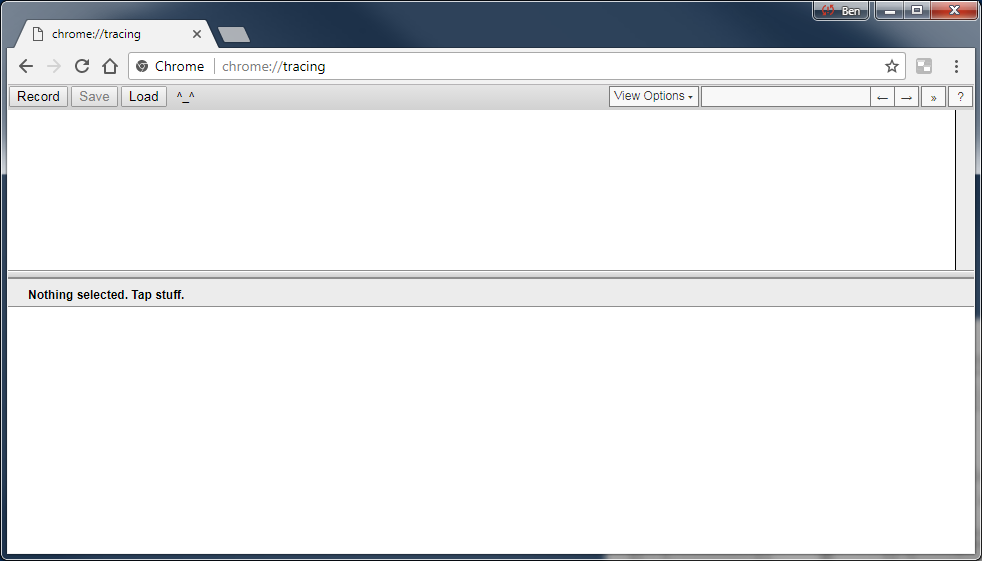
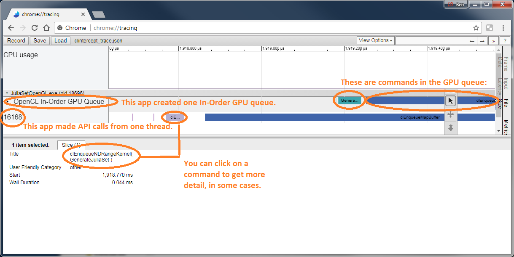

# Using the Intercept Layer for OpenCL Applications with Chrome Tracing

The Intercept Layer for OpenCL Applications includes support for generating
JSON files compatible with the Google Chrome built-in profiler front end.
This document describes how to use the Intercept Layer for OpenCL Applications
to visualize how an OpenCL application executes using Chrome Tracing.

## Background and Setup

The Chrome Tracing Format is described [here][chrome_tracing_format].

To start up the Chrome Tracing front end, open Chrome and enter
`chrome://tracing` as your "URL".  This should give you a Window that
looks like this one:

## Configuring Chrome Tracing

There are (currently) two Chrome Tracing-related controls for the Intercept
Layer for OpenCL Applications:

* `ChromeCallLogging`: This is the control for tracing OpenCL host APIs.
  It will plot OpenCL calls for each thread of the host application,
  similar to those dumped when `CallLogging` is enabled.
* `ChromePerformanceTiming`: This is the control for tracing OpenCL
  device commands.  It will plot OpenCL commands for each command queue
  created by the application, similar to those dumped when
  `DevicePerformanceTiming` is enabled.

## Collecting Chrome Tracing Data

After setting one of these two controls (or both!), run your application,
and you should see a "CLIntercept_trace.json" file in your CLIntercept_Dump
directory.

## Visualizing Chrome Tracing Data

After collecting a "CLIntercept_Trace.json" file, simply click the "load"
button in the "chrome::tracing" UI, or drag your file into Chrome.

If all goes well you will see a timegraph like this one:

You can navigate around the timegraph with 'wasd' controls similar to many
popular games: `w` zooms in, `s` zooms out, `a` goes backwards in time,
and `d` moves forwards in time.

Let's zoom in a bit and look at the what's in the timegraph:

## Overhead

Empirically, the overhead of Chrome Tracing is very low.  The difference in
scores between a run of LuxMark without Chrome Tracing vs. enabling
`ChromeCallLogging` and `ChromePerformanceTiming` was less than 1%, and the
trace file size for the 2+ minutes of execution was 26MB.

---

\* Other names and brands may be claimed as the property of others.

Copyright (c) 2018, Intel(R) Corporation

[chrome_tracing_format]: https://docs.google.com/document/d/1CvAClvFfyA5R-PhYUmn5OOQtYMH4h6I0nSsKchNAySU/preview
