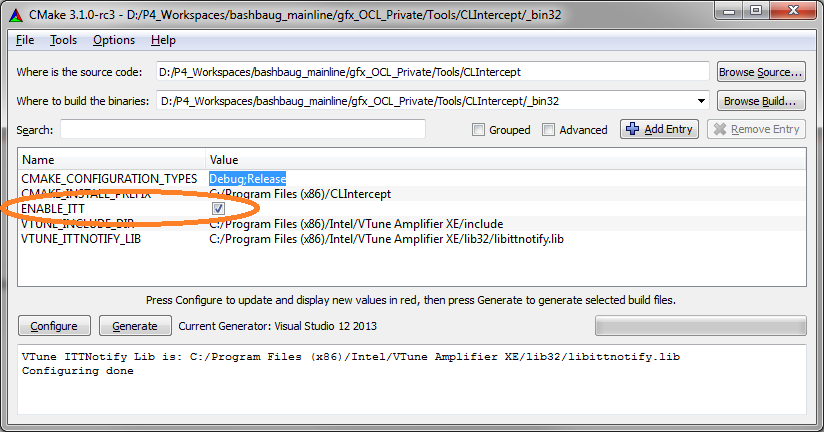
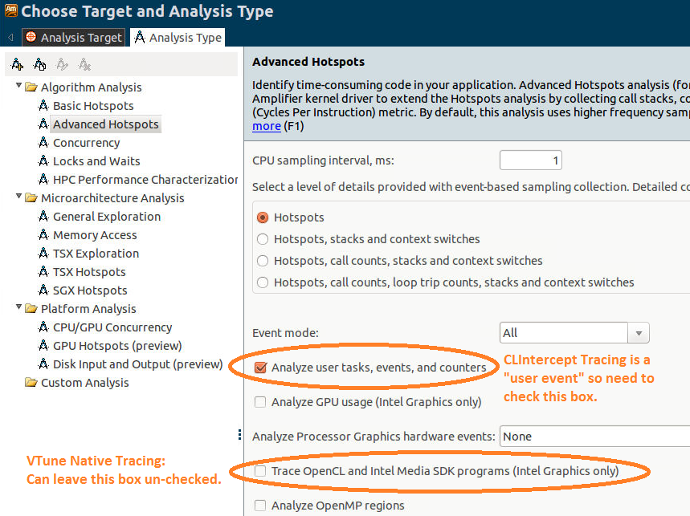
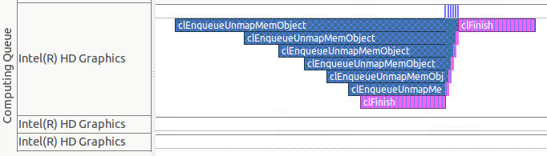

# Using the Intercept Layer for OpenCL Applications with Intel(R) VTune(tm) Amplifier XE

The Intercept Layer for OpenCL Applications can be built with support for the
Intel(R) VTune(tm) [Instrumentation and Tracing Technology (ITT)][itt] APIs, which
can add information about OpenCL-related calls to VTune timegraphs.  This document
describes how to build the Intercept Layer for OpenCL Applications with ITT support,
and how to set controls and VTune to display OpenCL events captured by the
Intercept Layer for OpenCL Applications.

## Why Use the Intercept Layer for OpenCL Applications?

Recent versions of VTune supports tracing OpenCL programs natively, however you still
may want to use CLIntercept's VTune integration:

* The VTune OpenCL tracing works for Intel(R) Processor Graphics only, however the
  Intercept Layer for OpenCL Applications's OpenCL tracing works for all OpenCL
  devices, including non-Intel OpenCL devices.
* The VTune OpenCL tracing works for a subset of OpenCL calls, however the Intercept
  Layer for OpenCL Applications's OpenCL tracing works for all OpenCL calls, including
  some non-API calls such as event callbacks.
* The Intercept Layer for OpenCL Applications's OpenCL tracing is very lightweight.

## Building the Intercept Layer for OpenCL Applications with ITT Support

To build the CLIntercept Intercept Layer for OpenCL Applications with ITT support,
be sure the "ENABLE_ITT" box is checked when configuring CMake:

You'll also want to be sure that the VTUNE_INCLUDE_DIR and VTUNE_ITTNOTIFY_LIB
variables are detected correctly.  They may be setup automatically, but for systems with
non-standard install paths they may need to be setup manually.

So long as this box is checked and the include and lib variables are setup correctly,
the Intercept Layer for OpenCL Applications should build without errors or warnings and
include ITT support.

## Configuring the Intercept Layer for OpenCL Applications for VTune

The main control to configure the Intercept Layer for OpenCL Applications for VTune
is `ITTCallLogging`.  This adds API call entry and exit information to VTune timegraphs.

## Configuring VTune for the Intercept Layer for OpenCL Applications

To configure VTune for the Intercept Layer for OpenCL Applications, checked the box for
'Analyze user tasks, events, and counters', since the Intercept Layer for OpenCL
Applications's ITT call logging is considered a "user event".

You do not need to check the box for 'Trace OpenCL and Media SDK programs (Intel Graphics
only)'.  This enables the native VTune support for OpenCL tracing.  If this box is checked
you'll likely see some OpenCL calls twice on the timegraph, since both the Intercept Layer
for OpenCL Applications and native VTune tracing will be enabled.

## Example VTune Output with the Intercept Layer for OpenCL Applications

Here is example output with ITTCallLogging.  Note that all API calls are logged, including
an event callback on a separate thread:

## Limitations and Restrictions

The biggest limitation at the moment is that you don't get any "device timing" information
in VTune, you only get information about host API calls.  This means that you won't see
output like the picture below that you'd get with the native VTune tracing:

---

\* Other names and brands may be claimed as the property of others.

Copyright (c) 2018-2024, Intel(R) Corporation

[itt]: https://software.intel.com/en-us/node/544195
